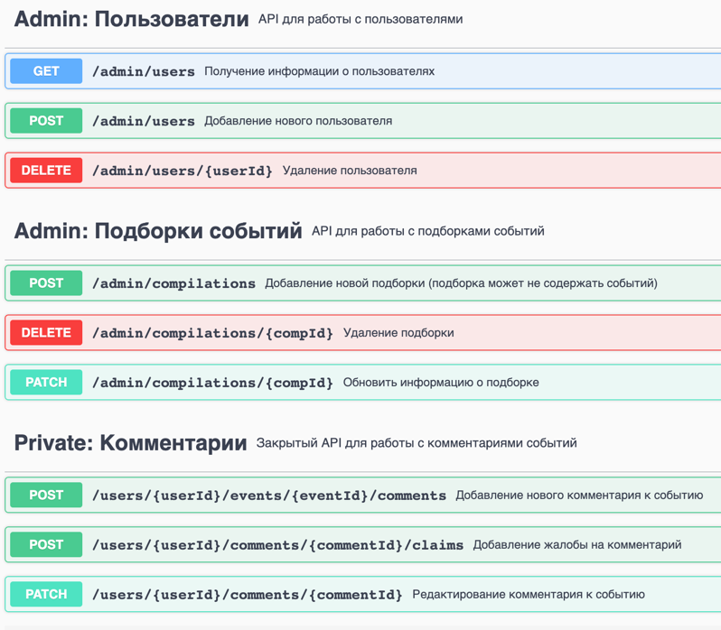

# Explore with Me

Приложение позволяющее делиться информацией об интересных событиях и помогать найти компанию для участия в них.
Случалось ли вам планировать мероприятие, искать информацию договариваться...
С сервисом - афишей вы легко сможете предложить какое-либо событие от выставки до похода в кино !

### Описание сервисов:

REST приложение реализовано с использованием микросервисной архитектуры.

1. Основной сервис — содержит всё необходимое для работы приложения.
2. Сервис статистики — хранит количество просмотров и позволяет делать различные выборки для анализа работы приложения.

### Возможности приложения:

1. Управление событиями мероприятий
2. Поиск событий и их просмотр
3. Создание различных подборок мероприятий
4. Публичный и авторизованный доступ пользователей
5. Возможность подписок на зарегистрированных пользователей
6. Управление категориями для мероприятий
7. Возможности модерации для администраторов
8. Сбор статистики обращений пользователей и их количество

### Демо:
* [Swagger](http://nr.ddns.ms:8012/swagger-ui/index.html)
* [Backend base path](http://nr.ddns.ms:8012)

---

Спецификация API доступна через [Swagger-editor](https://swagger.io/tools/swagger-editor/). Для ее просмотра необходимо импортировать в Swagger файлы:

[ewm-main-service-somments-spec](swagger/ewm-main-service-somments-spec.json)
[ewm-stats-service-spec](swagger/ewm-stats-service-spec.json)

Пример, методов API доступных через Swagger:


---

### Жизненный цикл событие модели данных:

1. Создание события.
2. Ожидание публикации. В статус ожидания публикации событие переходит сразу после создания.
3. Публикация. В это состояние событие переводит администратор.
4. Отмена публикации. В это состояние событие переходит в двух случаях. Первый — если администратор решил, что его нельзя публиковать. Второй — когда инициатор события решил отменить его на этапе ожидания публикации.

---

### Схема базы данных


---

### Стек технологий

* Java 11
* Spring Boot 2.7
* Hibernate
* PostgreSQL
* H2
* Maven
* Docker Compose
* Lombok
* MapStruct
* Postman
* IntelliJ IDEA

---

### Запуск приложения

Потребуется Java 11, Docker, Git, Apache Maven

1. Склонировать

```shell
git clone https://github.com/Azark1n/java-explore-with-me
```

2. Собрать проект

```shell
mvn clean package
```

3. Запустить через Docker Compose

```shell
docker compose up
```

---

### Выполнение тестирования

Подготовлены коллекции тестов, используя Postman для основного сервиса и сервиса статистики

```shell
postman/ewm-main-service.json
postman/ewm-stat-service_1.json
postman/ewm-stat-service_2.json
postman/feature-comments.json
```