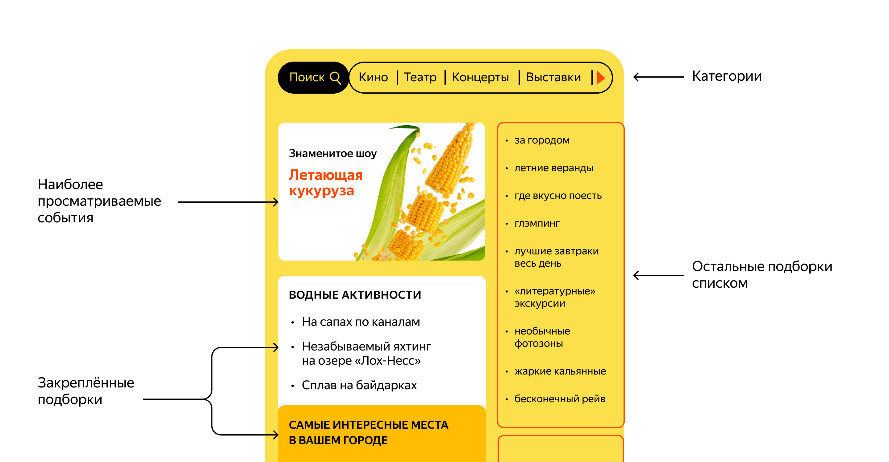

# Техническое задание

В рамках дипломного проекта вам предстоит разработать приложение `ExploreWithMe` (англ. «исследуй со мной»). Оно позволит пользователям делиться информацией об интересных событиях и находить компанию для участия в них.

# Идея

Свободное время — ценный ресурс. Ежедневно мы планируем, как его потратить — куда и с кем сходить. Сложнее всего в таком планировании поиск информации и переговоры. Нужно учесть много деталей: какие намечаются мероприятия, свободны ли в этот момент друзья, как всех пригласить и где собраться.

Приложение, которое вы будете создавать, — афиша. В этой афише можно предложить какое-либо событие от выставки до похода в кино и собрать компанию для участия в нём.



## Два сервиса

Вам нужно создать два сервиса:

* **основной сервис** будет содержать всё необходимое для работы продукта;
* **сервис статистики** будет хранить количество просмотров и позволит делать различные выборки для анализа работы приложения.

Разберём подробнее, что требуется от каждого сервиса.

### Основной сервис

API основного сервиса разделите на три части:

* **публичная** будет доступна без регистрации любому пользователю сети;
* **закрытая** будет доступна только авторизованным пользователям;
* **административная** — для администраторов сервиса.

К каждой из частей есть свои требования. Рассмотрим их.

### Требования к публичному API

Публичный API должен предоставлять возможности поиска и фильтрации событий. Учтите следующие моменты:

* сортировка списка событий должна быть организована либо по количеству просмотров, которое будет запрашиваться в сервисе статистики, либо по датам событий;
* при просмотре списка событий должна возвращаться только краткая информация о мероприятиях;
* просмотр подробной информации о конкретном событии нужно настроить отдельно (через отдельный эндпоинт);
* каждое событие должно относиться к какой-то из закреплённых в приложении категорий;
* должна быть настроена возможность получения всех имеющихся категорий и подборок событий (такие подборки будут составлять администраторы ресурса);
* каждый публичный запрос для получения списка событий или полной информации о мероприятии должен фиксироваться сервисом статистики.

### Подсказка: как узнать IP-адрес клиента, который отправил запрос

Чтобы передать в сервис статистики информацию об обработке запроса к эндпоинту, вам потребуется IP-адрес пользователя, сделавшего запрос, а также путь эндпоинта. Получить эту информацию можно через класс `HttpServletRequest`. Чтобы получить объект этого класса, добавьте его в качестве дополнительного аргумента в метод контроллера.

```JAVA
@GetMapping("/some/path/{id}")
public void logIPAndPath(@PathVariable long id, HttpServletRequest request) {
    log.info("client ip: {}", request.getRemoteAddr());
    log.info("endpoint path: {}", request.getRequestURI());
} 
```

### Требования к API для авторизованных пользователей

Закрытая часть API должна реализовать возможности зарегистрированных пользователей продукта. Вот что нужно учесть:

* авторизованные пользователи должны иметь возможность добавлять в приложение новые мероприятия, редактировать их и просматривать после добавления;
* должна быть настроена подача заявок на участие в интересующих мероприятиях;
* создатель мероприятия должен иметь возможность подтверждать заявки, которые отправили другие пользователи сервиса.

### Требования к API для администратора

Административная часть API должна предоставлять возможности настройки и поддержки работы сервиса. Обратите внимание на эти пункты:

* нужно настроить добавление, изменение и удаление категорий для событий;
* должна появиться возможность добавлять, удалять и закреплять на главной странице подборки мероприятий;
* требуется наладить модерацию событий, размещённых пользователями, — публикация или отклонение;
* также должно быть настроено управление пользователями — добавление, активация, просмотр и удаление.

### Модель данных

Жизненный цикл события должен включать несколько этапов.

1. Создание.
2. Ожидание публикации. В статус ожидания публикации событие переходит сразу после создания.
3. Публикация. В это состояние событие переводит администратор.
4. Отмена публикации. В это состояние событие переходит в двух случаях. Первый — если администратор решил, что его нельзя публиковать. Второй — когда инициатор события решил отменить его на этапе ожидания публикации.

Чтобы избежать распространённых ошибок при работе с моделью данных, применяйте знания из урока о подготовке к взаимодействию с БД.

➡️ **Аутентификация и авторизация** Оба сервиса `ExploreWithMe` работают внутри VPN. **VPN** (*Virtual Private Network* — англ. «виртуальная частная сеть») — совокупность технологий, позволяющих обеспечить одно или несколько сетевых соединений (логическую сеть) поверх другой сети (например, Интернет). С внешним миром сервисы связывает сетевой шлюз. Он контактирует с системой аутентификации и авторизации, а затем перенаправляет запрос в сервисы. То есть, если шлюз пропустил запрос к закрытой или административной части API, значит, этот запрос успешно прошел аутентификацию и авторизацию.

### Сервис статистики

Второй сервис — сервис статистики. Он будет собирать информацию. Во-первых, о количестве обращений пользователей к спискам событий и, во-вторых, о количестве запросов к подробной информации о событии. На основе этой информации должна формироваться статистика о работе приложения.

### Подсказка: эндпоинты для статистики

Сохранять статистику нужно будет по двум эндпоинтам: `GET /events`, который отвечает за получение событий с возможностью фильтрации, и `GET /events/{id}`, который позволяет получить подробную информацию об опубликованном событии по его идентификатору.

---

Функционал сервиса статистики должен содержать:

* запись информации о том, что был обработан запрос к эндпоинту API;
* предоставление статистики за выбранные даты по выбранному эндпоинту.

Чтобы можно было использовать сервис статистики, нужно разработать HTTP-клиент. Он будет отправлять запросы и обрабатывать ответы. Можно использовать [HTTP-клиент, который входит в состав JDK](https://docs.oracle.com/en/java/javase/11/docs/api/java.net.http/java/net/http/HttpClient.html), или [RestTemplate, входящий в состав Spring Framework](https://docs.spring.io/spring-framework/docs/current/javadoc-api/org/springframework/web/client/RestTemplate.html).

## Спецификация API

Для обоих сервисов мы разработали подробные спецификации API:

* спецификация основного сервиса: [ewm-main-service-spec.json](../swagger/ewm-main-service-spec.json);
* спецификация сервиса статистики: [ewm-stats-service.json](../swagger/ewm-stats-service-spec.json).

Для работы с ними вам понадобится редактор Swagger. Если вы не помните, как открыть спецификацию с его помощью, воспользуйтесь подсказкой ниже.

### Подсказка: как открыть спецификацию с помощью редактора Swagger

1. Скопируйте ссылку на файл спецификации.
2. Откройте [онлайн-версию редактора Swagger](https://editor-next.swagger.io/). На верхней панели выберите меню `File`, затем пункт `Import URL`.
3. Вставьте скопированную ссылку в текстовое поле появившегося диалогового окна и нажмите `OK`.

Чтобы освежить знания о том, как пользоваться нашими спецификациями, обратитесь к уроку о Swagger.

## Фичи для самостоятельного проектирования

Помимо основной части, вам также необходимо реализовать дополнительную функциональность. Приступайте к её реализации сразу после успешного прохождения ревью основной части дипломного задания. Спланировать то, какую функциональность вы возьмёте и как будете с ней работать, стóит ещё в начале работы над дипломом.

💡 Обратите внимание: реализацию дополнительной функциональности нужно поместить в отдельную ветку.

Как именно реализовать дополнительную фичу в коде, каким требованиям она должна соответствовать, как интегрировать её в проект и API — вы решаете сами. Вы можете выбрать любую функциональность из нашего списка.

Мы предлагаем следующие варианты:

* Комментарии

Возможность оставлять комментарии к событиям и модерировать их.

* Подписки
  * Первый вариант. Возможность подписываться на других пользователей и получать список актуальных событий, опубликованных этими пользователями.
  * Второй вариант. Подписка на друзей и возможность получать список актуальных событий, в которых они принимают участие.
* Рейтинги

Возможность ставить лайк/дизлайк событию. Формирование рейтинга мероприятий и рейтинга их авторов. Возможность сортировки событий в зависимости от рейтингов.

* Администрирование
  * Первый вариант. Возможность для администратора добавлять конкретные локации — города, театры, концертные залы и другие в виде координат (широта, долгота, радиус). Получение списка этих локаций. Возможность поиска событий в конкретной локации.
  * Второй вариант. Улучшение модерации событий администратором — возможность выгружать все события, ожидающие модерации, делать их проверку, а также оставлять комментарий для инициатора события, если оно не прошло модерацию. При этом у инициатора есть возможность исправить замечания и отправить событие на повторную модерацию.

### Подсказка: функция реализации работы с координатами для PostgreSQL

Эта функция принимает на вход координаты (градусы широты и долготы) двух точек и вычисляет дистанцию между ними. Её можно использовать для упрощённой проверки, попадает ли локация проведения события в заданную область. Если дистанция от локации события до центра окружности (выбранной области) не превышает радиуса этой окружности, значит, оно проходит в выборку.

```SQL
CREATE OR REPLACE FUNCTION distance(lat1 float, lon1 float, lat2 float, lon2 float)
    RETURNS float
AS
'
declare
    dist float = 0;
    rad_lat1 float;
    rad_lat2 float;
    theta float;
    rad_theta float;
BEGIN
    IF lat1 = lat2 AND lon1 = lon2
    THEN
        RETURN dist;
    ELSE
        -- переводим градусы широты в радианы
        rad_lat1 = pi() * lat1 / 180;
        -- переводим градусы долготы в радианы
        rad_lat2 = pi() * lat2 / 180;
        -- находим разность долгот
        theta = lon1 - lon2;
        -- переводим градусы в радианы
        rad_theta = pi() * theta / 180;
        -- находим длину ортодромии
        dist = sin(rad_lat1) * sin(rad_lat2) + cos(rad_lat1) * cos(rad_lat2) * cos(rad_theta);

        IF dist > 1
            THEN dist = 1;
        END IF;

        dist = acos(dist);
        -- переводим радианы в градусы
        dist = dist * 180 / pi();
        -- переводим градусы в километры
        dist = dist * 60 * 1.8524;

        RETURN dist;
    END IF;
END;
'
LANGUAGE PLPGSQL;
```

💡 Обратите внимание: вам нужно реализовать только одну дополнительную функциональность. Выбирайте её в зависимости от вашего уровня владения Java, времени на диплом и внутренних ресурсов.

### Как работать с функциональностью

После выбора функциональности не торопитесь сразу реализовать её. Продумайте сценарии её использования и ограничения. Вот примеры вопросов по каждой из фич, на которые лучше найти ответы до того, как приступать к написанию кода.

* **Комментирование**. Может ли пользователь, оставивший комментарий, отредактировать его позже?
* **Подписка на пользователей**. Могут ли пользователи запрещать подписку на себя?
* **Подписка на друзей**. Показывать ли все события друзьям или дать возможность делиться выбранными событиями или скрывать их?
* **Рейтинг**. Показывать ли рейтинг события/пользователя публично? Разрешить ставить лайк/дизлайк любым событиям или только посещённым?
* **Локации**. Ограничивать ли пользователей при добавлении события только заданными в системе локациями?
* **Модерация**. Как повлияет на модерацию жизненный цикл события от создания до его проведения?

### \* Задача со звёздочкой — тесты

Вы уже знаете на собственном опыте, что разработчики не могут не ошибаться. Чтобы находить ошибки и несоответствия как можно раньше, код нужно покрывать тестами. Реализуйте модульные тесты для проверки функциональности вашего проекта. Это потребует времени, но также принесёт ощутимый результат.

# Напутственная аффирмация

У вас точно всё получится! Вы уже молодец! Вы много знаете и умеете! Дипломный проект Java вам по зубам! Да пребудет с вами сила!
